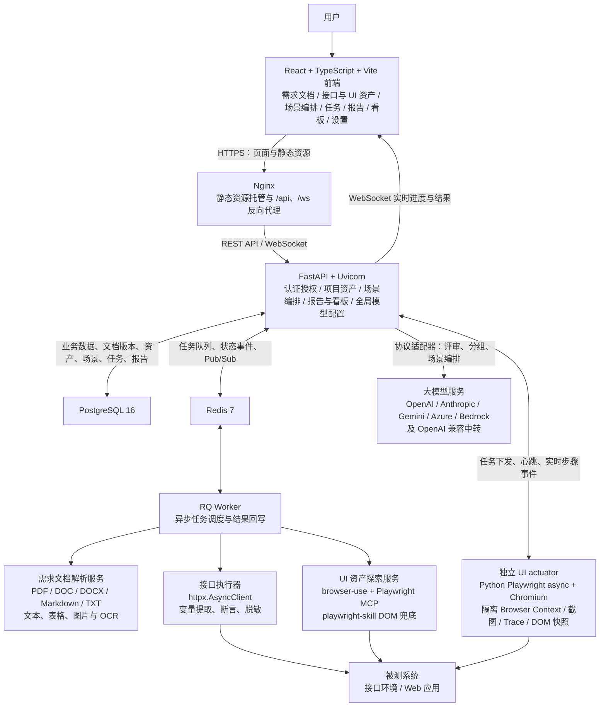
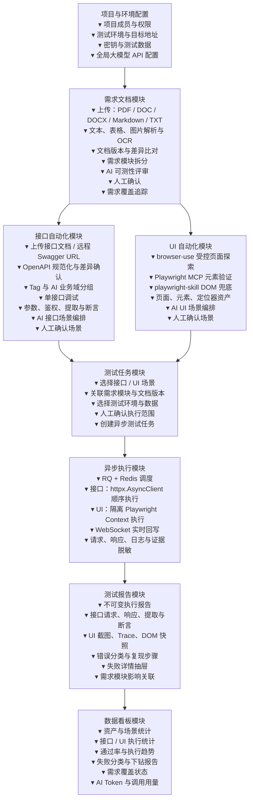

## AI自动化测试

### 技术栈

`ai-test-platform` 是一个前后端分离、容器化部署的 AI 自动化测试平台，覆盖需求解析、AI 用例生成、接口自动化、UI 自动化、异步执行与结果实时展示。

| 层级 | 技术栈 | 职责 |
| :-- | :-- | :-- |
| 前端框架 | React 18、TypeScript、Vite 5 | 继续沿用现有前端框架，承载需求资产、接口/UI 编排、任务中心、报告、看板与系统设置。 |
| 前端组件与状态 | Ant Design 5、Ant Design Icons、Zustand、React Router 6、Axios、Day.js、ECharts | 提供企业级表单与表格、状态管理、路由、HTTP 请求、日期处理和看板图表。 |
| 后端服务 | Python 3.12、FastAPI、Uvicorn | 提供异步 REST API、自动生成的 OpenAPI 文档及 WebSocket 服务。 |
| 数据访问与校验 | SQLAlchemy 2.0 Async、asyncpg、Alembic、Pydantic 2、pydantic-settings | 实现异步 ORM、PostgreSQL 访问、数据库迁移、数据模型校验与环境配置管理。 |
| 数据库 | PostgreSQL 16 | 持久化用户、项目、需求文档、测试资产、测试场景、执行记录与报告等业务数据。 |
| 异步任务与消息 | Redis 7、RQ、Redis Pub/Sub | 运行后台任务队列，并在 Worker、API 服务和 WebSocket 连接之间传递任务状态和实时事件。 |
| 实时通信 | FastAPI WebSocket | 支持执行器注册、任务分发、执行进度、扫描进度、日志和截图状态的实时推送。 |
| 接口自动化 | OpenAPI 3.0/3.1、Swagger 2.0、httpx.AsyncClient、JMESPath、PyYAML | 将上传或远程导入的接口文档规范化为 OpenAPI 资产，支持单接口调试、变量提取、断言与异步场景执行。 |
| UI 自动化探索 | browser-use、Playwright MCP、playwright-skill | 在受控场景中发现页面路径与交互，验证页面结构和元素，并生成可审计的定位器资产。 |
| UI 自动化执行 | Python Playwright async、Chromium、独立 actuator 执行器 | 在隔离浏览器上下文中稳定执行已确认的 UI 场景，采集截图、Trace、DOM 快照和步骤日志；执行器可横向扩展。 |
| AI | httpx、多协议 LLM 适配器 | 支持 OpenAI Chat Completions/Responses、Anthropic Messages、Gemini、Azure OpenAI、Bedrock Converse 及 OpenAI 兼容中转端点，用于需求评审、接口分组与测试场景编排。 |
| 需求文档解析 | python-docx、pypdf | 解析 Word 与 PDF 格式的需求文档，为 AI 用例生成提供输入。 |
| 认证与安全 | PyJWT、PBKDF2、SHA-256 | 实现 JWT 和 API Key 双认证；密码与密钥以不可逆摘要形式保存。 |
| 部署与网关 | Docker、Docker Compose、Nginx、Node 20 Alpine、Python Slim | 使用容器化交付；Nginx 托管前端静态资源，并反向代理 API 和 WebSocket。 |

### 运行架构



### 平台总流程



### 需求文档模块

需求文档模块是接口自动化与 UI 自动化的上游项目资产，负责将原始需求转化为可确认、可引用、可追踪的需求模块。该模块不使用 RAG，也不进行隐式知识检索；所有 AI 分析均严格基于用户当前明确选择的需求文档版本和需求模块内容。

#### 1. 文档上传、解析与版本管理

平台支持上传 `PDF`、`DOC`、`DOCX`、Markdown（`.md`/`.markdown`）和 `TXT` 格式的需求文档，并保留原始文件、解析结果、上传人、上传时间和文档版本。所有格式先经过专用解析器，再转换为统一的文档内容结构，避免后续需求拆分和 AI 分析依赖某一种文件格式。

```text
RequirementDocument
  -> DocumentVersion
  -> SourceFile
  -> ParseJob
  -> ContentBlock[]
       heading / paragraph / table / image / code / list
  -> RequirementModule[]
```

每个 `ContentBlock` 必须保留来源定位信息，例如 PDF 页码、Word 段落序号、Markdown 标题路径或 TXT 行号，使需求模块、AI 评审和测试场景能够回链到原始文档位置。

| 格式 | 解析策略 | 特殊处理 |
| --- | --- | --- |
| PDF | 优先提取原生文本、表格和图片。 | 文本为空或质量过低时逐页转图 OCR；保留页码、图片和表格位置。 |
| DOCX | 提取标题、段落、列表、表格和嵌入图片。 | 保留标题层级，作为需求模块的候选边界。 |
| DOC | 在隔离容器中转换为 DOCX 或 PDF 后复用对应解析管线。 | 转换失败时提示用户重新导出为 DOCX 或 PDF，不进行不可靠的直接解析。 |
| Markdown | 解析标题层级、段落、列表、表格、代码块和图片引用。 | 本地图片作为关联附件上传；远程图片仅记录链接，不主动抓取。 |
| TXT | 检测 UTF-8、UTF-8 BOM、GBK 等常见编码，并按空行、编号和标题模式切块。 | 无结构文本生成候选段落，支持人工调整模块边界。 |

文档解析由 RQ 异步任务执行，避免大文件、图片解析或 OCR 阻塞 FastAPI 请求。上传时校验扩展名、MIME 类型、文件内容真实性、大小和页数；解析时限制图片数量、OCR 页数和执行时长。超限或解析失败时，系统应返回明确原因，并支持用户选择页码范围或重新上传。

系统提取文档文字、表格与图片内容：原生文本直接解析；扫描件或图片中的文字通过 OCR 提取；流程图、原型图和表格等无法完全可靠识别的内容必须支持人工校正。OCR、表格和图片识别结果应记录置信度，低置信度区块进入人工校正队列。

需求文档版本不可变，系统通过文件 SHA-256 识别重复上传。上传新版本后，系统重新解析并生成需求模块的新增、删除和变更差异；引用旧版本需求模块的测试场景应被标记为“因需求变更待复核”，而不是继续视为有效覆盖。加密 PDF 或受密码保护的 Word 文件可要求用户一次性提供解析密码，解析完成后不保存该密码。

#### 2. 需求模块拆分与可测性评审

系统根据功能边界将文档拆分为需求模块，例如“用户登录”“订单创建”“退款审批”。每个模块保留名称、所属文档版本、正文内容、关联图片或表格、来源页码或段落，以及人工校正记录。

AI 对每个需求模块输出结构化可测性评审，包括：

- 功能测试点与建议覆盖的正常、异常、边界场景。
- 前置条件、测试数据与依赖系统。
- 缺失条件、业务歧义和不可验证的描述。
- 质量、权限、数据一致性、异常处理等风险。
- 建议补充的验收标准或需求说明。

AI 的拆分与评审结果均为候选内容。人工确认模块边界和评审结论后，需求模块才可被接口分组、AI 场景编排和测试覆盖追踪引用。

#### 3. 作为自动化测试上下文

用户可明确选择一个或多个已确认的需求模块，作为接口自动化和 UI 自动化的上下文：

1. 在接口自动化中，辅助接口业务域分组，并向 AI 场景编排提供业务目标、约束与预期结果。
2. 在 UI 自动化中，辅助识别当前测试场景所需的页面、操作路径、数据和断言。
3. AI 仅接收当前选定模块的内容及其关联文档片段，不读取其他文档、历史对话或未选择的项目资产。

#### 4. 覆盖追踪与影响分析

系统建立并维护“需求模块 -> 测试场景 -> 执行报告”的可追溯关联。每个需求模块至少展示以下覆盖状态：未编排、待确认、已覆盖、执行通过、执行失败、因需求变更待复核。

通过该关联，用户可以查看每项需求是否已有接口或 UI 测试覆盖、未覆盖的测试点、最近一次执行结果，以及失败的测试场景具体影响哪一项需求。需求版本变更后，系统基于关联关系定位受影响的场景与报告，供人工复核和更新。

#### 模块流程

```text
上传需求文档
  -> 原始文件与版本保存
  -> 文本 / 表格 / 图片解析与人工校正
  -> 按功能拆分需求模块
  -> AI 输出可测性评审
  -> 人工确认模块与评审结果
  -> 用户显式选择需求模块作为测试上下文
  -> 接口分组 / 接口场景编排 / UI 场景编排
  -> 建立需求模块 -> 测试场景 -> 执行报告关联
  -> 覆盖状态与需求变更影响分析
```

### UI 自动化模块

UI 自动化遵循平台主流程：**资产配置 -> 用例编排 -> 创建测试任务 -> 异步执行 -> 结果回写**。其中，AI 负责受控探索、理解页面和生成候选方案；人工负责授权与确认；隔离的 Playwright 执行器负责稳定、可复现的正式执行。

#### 1. 页面与元素资产配置

1. 由 `browser-use` 在已定义的测试场景内发现页面路径和交互流程。
2. 使用 Playwright MCP 读取页面结构并验证候选元素；必要时使用 `playwright-skill` 获取 DOM 结构作为兜底证据。
3. 探索仅覆盖当前场景所需的页面和元素，不执行默认全量扫描。
4. 每个场景必须定义探索范围：允许访问的域名、起始 URL、允许页面、最大探索步数、允许操作和禁止操作。探索默认只读；提交、删除、支付、发信等有副作用的操作必须使用测试数据并获得明确授权。
5. 同一浏览器会话只允许一个主控制方。`browser-use` 负责规划和探索，Playwright MCP 负责页面结构验证；正式回归执行由 Python Playwright async 执行器独立完成。

页面、元素和定位器作为可复用测试资产保存。每个定位器按以下优先级生成并验证：

```text
data-testid
  -> role + name
  -> label / placeholder / name
  -> 稳定 CSS
  -> XPath（仅最后兜底）
```

定位器资产需记录主定位器、候选降级定位器、唯一性、可见性、可操作性、验证页面 URL、DOM 指纹和验证时间，并进行版本化管理。

#### 2. AI 对话与用例编排

用户通过 Agent 对话描述测试目标、业务操作、预期结果和所需测试数据。AI 基于已配置的页面、元素和定位器资产，自动获取允许范围内的数据并生成候选测试步骤，包括：前置条件、操作步骤、输入数据、断言、预期结果和失败时的证据采集要求。

AI 生成的步骤不直接执行。人工必须确认用例版本、步骤顺序、测试数据、预期结果和允许执行范围后，系统才可创建测试任务。

密码、Token 等敏感数据不得以明文进入 LLM 对话历史、测试步骤、日志、截图、Trace 或 DOM 快照。用例只引用密钥标识，例如 `{{secret.login_password}}`；执行器在运行时按权限注入明文，并在所有输出中完成脱敏。

#### 3. 异步隔离执行

确认后的用例创建为异步任务，由 RQ Worker 调度到独立的 Python Playwright async 执行器。执行器为每个任务建立隔离的浏览器上下文，避免 Cookie、缓存和会话数据在任务之间串扰。

在获得授权的同一场景内，执行器可加载经加密保存的 `storage_state` 维持登录态。`storage_state` 必须绑定项目、环境、目标域名、创建人、有效期和允许使用的场景，禁止跨环境或跨域复用。

每一步执行均应回写状态、耗时、输入与断言结果，并保存必要的证据：截图或 Playwright Trace、DOM 快照、浏览器/网络错误和步骤日志。

#### 4. 失败诊断与人工修复确认

任务失败后，系统基于执行证据识别问题类型，至少包括：产品缺陷、定位器失效、页面加载或环境异常、认证失效、测试数据异常、执行器异常及预期结果不一致。

失败时仅对失败步骤关联的页面或元素进行局部重采集，生成候选定位器或步骤修复方案。系统不得静默修改用例或自动重跑；所有修复方案均须经人工确认后生效。

#### 5. 结果展示

执行结果通过 WebSocket 实时回写至前端。失败任务使用执行详情抽屉展示：失败步骤、实际结果与预期结果、错误分类、错误信息、关联截图或 Trace、DOM 快照及可直接复现的操作步骤。

截图、Trace 和 DOM 快照可能包含个人信息、页面内容或会话痕迹，因此必须遵循脱敏、访问控制、保留期限和删除策略。

#### 模块流程

```text
资产配置
  -> 受控页面探索与元素验证
  -> 保存页面 / 元素 / 定位器资产
  -> Agent 生成候选测试步骤
  -> 人工确认步骤、数据、预期与执行范围
  -> 创建异步任务
  -> 隔离 Playwright Context 执行
  -> 回写日志、截图 / Trace / DOM 证据
  -> 抽屉展示结果与复现步骤
  -> 失败局部重采集，生成候选修复，人工确认
```

### 接口自动化模块

接口自动化同样遵循平台主流程：**资产配置 -> 用例编排 -> 创建测试任务 -> 异步执行 -> 结果回写**。OpenAPI 接口资产是唯一事实来源；单接口调试用于验证接口资产；AI 仅生成候选场景；人工确认后由统一异步执行器运行并回写脱敏证据。

#### 1. 接口文档导入与 OpenAPI 规范化

平台支持以下接口文档来源：

1. 上传 JSON 或 YAML 格式的接口文档文件。
2. 通过远程 Swagger/OpenAPI URL 拉取接口文档。

远程 URL 导入支持四种文档拉取鉴权方式：无鉴权、Basic 用户名/密码、Bearer Token，以及任意一个单独的自定义请求头。鉴权数据必须以密钥引用保存，不得出现在导入记录、操作日志、错误信息或 AI 上下文中。

所有输入文档统一转换为平台内部 OpenAPI 模型，并保留原始文档快照、来源地址、导入时间、文档版本、解析结果和转换告警。首期至少支持 Swagger 2.0、OpenAPI 3.0 与 OpenAPI 3.1；对无法无损转换的扩展字段、复杂 Schema、回调或安全定义，系统必须明确提示而不得静默丢弃。

远程导入必须限制为 HTTP/HTTPS 协议，并拦截回环、内网、云元数据等受保护地址。系统应在重定向后重新校验目标地址，并限制文件大小、下载时长和重定向次数，防止 SSRF 与异常文档导致服务资源耗尽。

接口资产以“来源版本 + HTTP 方法 + 规范化路径”作为稳定标识。重复导入时生成新增、更新、删除和冲突的差异预览，由人工确认后再入库，避免覆盖手工维护的请求配置、断言和场景引用。

#### 2. 接口分组与业务域识别

系统优先按 OpenAPI `tag` 分组，并完整保留原始 tags。一个接口可拥有多个标签，同时保存一个主分组用于模块树展示。

当接口缺少 `tag` 时，系统按以下顺序生成候选分组：

1. 根据路径前缀进行确定性归类。
2. 根据接口名称和描述补充分组信息。
3. 由 AI 结合 HTTP 方法、路径、参数名、描述和需求上下文识别业务域，并生成中文组名，例如“认证与权限”“用户与组织”。

AI 分组仅作为候选建议。人工确认后的分组在后续重复导入时不得被静默修改。

#### 3. 单接口调试

在 AI 场景编排之前，平台保留完整的单接口调试能力，并以 WHartTest 的接口调试页面作为功能对照。页面至少支持：

- 接口模块树、接口列表和接口基础信息编辑。
- HTTP 方法、URL、Query 参数、Path 参数、请求头、Cookie、请求体和内容类型配置。
- 无鉴权、Basic、Bearer、API Key 或自定义请求头鉴权配置。
- 全局变量、环境变量、接口变量和密钥引用；变量优先级由统一请求模型定义。
- 请求前置与后置处理、变量提取、响应断言，以及后续可扩展的 SQL 校验与 Hook 能力。
- 目标环境选择、即时执行，以及脱敏后的请求、响应、断言结果、耗时和错误信息展示。

单接口调试与场景编排必须共用同一套请求模型、变量解析、鉴权、序列化、提取、断言、超时和脱敏规则，保证调试成功的接口进入场景后可得到一致的执行结果。

#### 4. AI 场景编排

用户选择已导入的接口和目标环境后，在 AI 场景编排聊天框中以自然语言描述要验证的业务流程与预期结果。系统向 LLM 提供已授权的接口元数据、参数 Schema、描述、环境变量引用和需求上下文，不提供明文密钥或未经脱敏的历史响应。

LLM 默认生成 2 至 5 步候选场景；较长流程可拆分为多个可复用场景。每一步必须包含接口引用、请求覆盖项、前置条件、变量来源、变量提取、断言、预期结果和失败时的证据要求。

场景内的数据依赖需要显式声明。例如，登录步骤提取 `access_token`，后续步骤通过变量引用使用该值。变量需记录来源步骤、作用域、数据类型、脱敏属性和缺失时的失败规则。

AI 生成的场景不能直接执行。人工确认场景版本、步骤顺序、测试数据、预期结果、允许执行的方法与目标环境后，才可创建测试任务。

#### 5. 异步执行与结果回写

经确认的场景由 RQ Worker 异步调度，使用 `httpx.AsyncClient` 按步骤顺序执行。执行器须设置目标环境白名单、连接/读取/总超时、响应体大小上限、并发配额和重定向策略；仅对明确安全且幂等的请求执行重试，禁止因网络异常自动重试具有副作用的写操作。

每个步骤实时回写请求摘要、响应摘要、变量提取结果、断言结果、耗时和错误信息。所有展示、日志和持久化证据均需统一脱敏，包括 Authorization、Cookie、API Key、URL 查询参数、请求体密码字段、响应中的 Token 及个人信息。

前端通过 WebSocket 实时展示执行进度。失败任务使用执行详情抽屉展示失败步骤、实际结果与预期结果、错误分类、脱敏请求和响应、断言详情及可复现的调用顺序。

#### 模块流程

```text
上传文件或远程 Swagger/OpenAPI URL
  -> 文档校验、鉴权拉取与 OpenAPI 规范化
  -> 差异预览并确认入库
  -> tag / 路径规则 / AI 候选业务域分组
  -> 单接口调试与资产校验
  -> 选择接口和目标环境
  -> AI 生成候选场景
  -> 人工确认步骤、数据、预期与执行范围
  -> RQ 异步调度 httpx.AsyncClient 顺序执行
  -> WebSocket 实时回写脱敏请求、响应、断言与结果
  -> 抽屉展示失败证据与复现顺序
```

### 测试报告与数据看板

测试报告与数据看板位于接口自动化模块之后，统一汇总接口与 UI 自动化的执行结果，并通过需求模块关联提供覆盖和影响视图。设计参考 WHartTest 的“项目概览 + 执行趋势 + 历史报告 + 单次报告详情”模式，但统计口径以本平台的需求模块、接口场景与 UI 场景为准。

#### 1. 统一测试报告

每次任务执行结束后生成不可变的测试报告。报告记录任务、项目、环境、执行时间、触发人、场景版本、需求模块版本、执行器版本、总体状态、总耗时、通过/失败/跳过/错误步骤数，并关联接口或 UI 的逐步骤执行明细。

接口步骤明细包含脱敏请求、脱敏响应、变量提取、断言结果、耗时和错误信息；UI 步骤明细包含操作、定位器版本、实际与预期结果、截图或 Trace、DOM 快照、浏览器或网络错误和复现步骤。报告一经生成不可被原场景后续编辑覆盖，确保历史结果可审计、可复现。

报告列表支持按项目、测试类型、环境、需求模块、场景、状态、执行人和时间范围筛选；可从任一失败步骤进入执行详情抽屉查看证据和关联需求影响。报告中的密钥、Token、Cookie、密码、个人信息及敏感请求/响应字段必须统一脱敏。

#### 2. 项目数据看板

看板以项目为范围，支持按时间范围和目标环境筛选。首期提供以下数据视图：

- 资产概览：需求模块、已导入接口、UI 页面/元素、接口场景与 UI 场景数量。
- 执行概览：总执行次数、通过数、失败数、错误数、跳过数、通过率与平均执行耗时。
- 分类型统计：接口自动化与 UI 自动化分别展示场景数、执行数、通过率和失败数。
- 执行趋势：按日或按周展示执行次数、通过数、失败数及通过率变化。
- 失败分析：按错误分类、需求模块、接口业务域、UI 页面或场景维度聚合失败次数，并可下钻到报告。
- 需求覆盖：展示每个需求模块的未编排、待确认、已覆盖、执行通过、执行失败和因需求变更待复核状态。
- AI 用量：按时间范围、模型配置和调用类型展示请求数、输入 Token、输出 Token、缓存 Token（如供应商返回）及估算费用；缺失用量数据时明确标记为“供应商未返回”。

统计数据必须由任务和报告的持久化事实计算，不以当前场景配置或可变的 AI 对话内容作为统计来源。看板卡片、趋势图和失败分布均可下钻至过滤后的报告列表，避免只提供无法追溯的汇总数字。

#### 3. 报告与看板流程

```text
接口 / UI 测试任务完成
  -> 回写逐步骤执行明细与脱敏证据
  -> 生成不可变测试报告
  -> 关联场景版本、需求模块版本与执行环境
  -> 汇总项目、类型、环境、需求模块和错误分类统计
  -> 看板展示概览、趋势、失败分析、覆盖状态与 AI 用量
  -> 下钻至报告列表、执行详情抽屉和受影响需求模块
```

### 全局大模型设置

全局大模型设置用于管理需求可测性评审、接口分组、接口场景编排和 UI 场景编排使用的模型服务。配置保存后在全平台立即生效；只有具有系统管理权限的用户可以查看、创建、修改、启用或停用配置。

#### 1. 协议适配与供应商预设

系统采用“协议适配器 + 供应商预设”的方式接入模型服务，而不为每家供应商维护独立业务逻辑。首期支持以下主流 API 格式：

- OpenAI Chat Completions：适用于 OpenAI、DeepSeek、通义千问兼容模式、智谱兼容模式、Ollama、vLLM、LM Studio 和多数中转服务。
- OpenAI Responses API：适用于 OpenAI Responses 及兼容中转服务。
- Anthropic Messages API：适用于 Anthropic Claude 及兼容中转服务。
- Google Gemini GenerateContent API：适用于 Gemini 原生 API。
- Azure OpenAI：支持 Azure 的部署名、API 版本及 Chat Completions 或 Responses 模式。
- Amazon Bedrock Converse API：支持 Bedrock 的模型标识与区域配置。

供应商预设只负责填充默认协议、默认地址和常见模型提示；用户仍可选择“自定义兼容端点”，填写中转地址并指定协议。任何未采用上述协议的服务需要新增适配器后才能接入，不能仅靠填写 URL 假定其可兼容。

#### 2. 配置页面与全局生效规则

配置页面提供配置名称、供应商预设、API 协议、模型名称或 Azure 部署名、API Key、Base URL/中转地址、区域与 API 版本（按协议显示）、请求超时、最大重试次数、上下文窗口、是否支持视觉输入、是否启用流式输出，以及是否为全局默认模型。

页面提供“测试连接”和“拉取模型列表”功能。测试连接仅发起最小化、无业务副作用的请求；拉取模型列表为可选能力，供应商不支持时允许手工填写模型名称。系统允许保存多个配置，但同一时刻只能启用一个全局默认配置；场景可记录实际使用的配置版本和模型名称，确保报告可追溯。

API Key 仅在创建或更新时写入，读取接口只返回是否已配置与掩码摘要。密钥必须加密存储，禁止出现在前端状态、日志、LLM 输入、报告或错误堆栈中；修改配置时留空 API Key 表示保留现有密钥。

#### 3. 移除经验召回与 Embedding

平台不再提供经验库语义召回、向量检索或 Embedding 模型配置。需求上下文完全来自用户显式选择的需求文档版本和需求模块；接口与 UI 场景上下文完全来自用户选择的测试资产。

因此可以移除 `pgvector` Python 依赖、PostgreSQL 的 vector 扩展、向量字段和索引、Embedding 服务调用、Embedding 环境变量及系统设置页面中的 Embedding 配置，同时删除经验召回相关 API、任务和数据迁移。PostgreSQL 继续作为业务主数据库保留。

#### 模块流程

```text
系统管理员创建或编辑模型配置
  -> 选择供应商预设或 API 协议
  -> 填写模型、API Key、Base URL / 中转地址及协议参数
  -> 测试连接或拉取可用模型（可选）
  -> 加密保存并设为全局默认配置
  -> 需求评审、接口分组、接口 / UI 场景编排读取当前有效配置
  -> 报告记录实际使用的模型配置版本和 Token 用量
```
